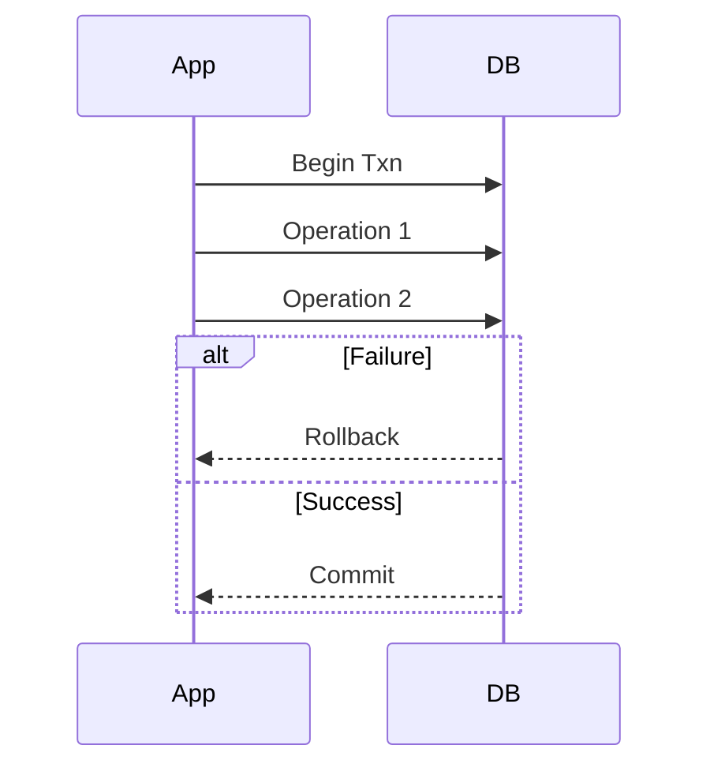
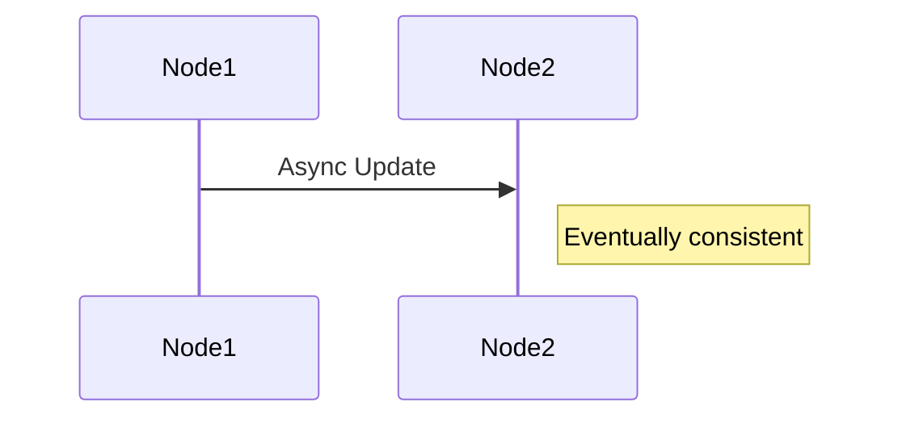
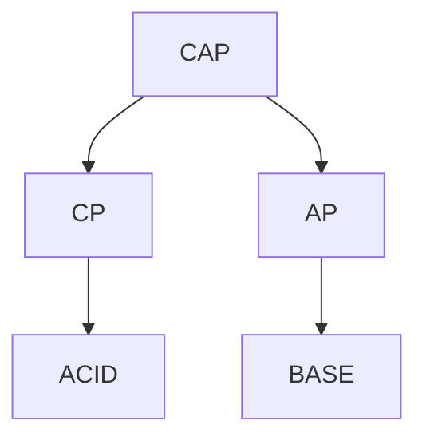

# 🧠 1. CAP THEOREM (Foundation of Distributed Systems)

---

## 📌 Definition

> In a distributed system, you can only guarantee **2 out of 3**:

* **C → Consistency**
* **A → Availability**
* **P → Partition Tolerance**

---

## 🔴 What is Partition?

👉 Network failure between nodes
Example:

* Region A cannot talk to Region B

👉 This is **inevitable in real systems**

---

## ⚠️ Core Rule

```text
Partition tolerance is mandatory → choose between Consistency or Availability
```

---

## 🧩 CAP Properties Deep Dive

---

### 🔵 Consistency (C)

👉 Every read gets **latest data**

Example:

* Bank balance updated → all users see updated value immediately

✔ Strong correctness
❌ Might block system

---

### 🟢 Availability (A)

👉 Every request gets a response

Example:

* Instagram feed always loads

✔ No downtime
❌ May return stale data

---

### 🔴 Partition Tolerance (P)

👉 System works despite network failures

✔ Required in distributed systems

---

## 🔥 System Types

---

### 🔹 CP System (Consistency + Partition Tolerance)

### 📌 Behavior

```text
If partition → system rejects or delays requests
```

### 📊 Flow

```mermaid
sequenceDiagram
    participant Client
    participant Node1
    participant Node2

    Client->>Node1: Write
    Node1-->>Node2: Sync

    alt Partition
        Node2 x-- Node1: Failure
        Node1-->>Client: Error / Wait
    end
```

### 🗄️ Databases (CP-oriented)

* **PostgreSQL** (strong consistency setups)
* **MySQL**
* **HBase**
* **MongoDB** (with majority write concern)

---

### 🔹 AP System (Availability + Partition Tolerance)

### 📌 Behavior

```text
If partition → system still responds (may be stale)
```

### 📊 Flow

```mermaid
sequenceDiagram
    participant Client
    participant Node1
    participant Node2

    Client->>Node1: Read

    alt Partition
        Node2 x-- Node1: Failure
        Node1-->>Client: Stale Data
    end
```

### 🗄️ Databases (AP-oriented)

* **Cassandra**
* **DynamoDB**
* **CouchDB**
* **Riak**

---

### 🔹 CA System

👉 Only possible without partition
❌ Not realistic in distributed systems

---

## 🧠 CAP Summary

| System | Consistency | Availability | Use Case     |
| ------ | ----------- | ------------ | ------------ |
| CP     | Strong      | Low          | Banking      |
| AP     | Eventual    | High         | Social media |

---

# 🧠 2. ACID (Strong Consistency Model)

---

## 📌 Definition

ACID ensures **reliable transactions**

---

## 🔹 Properties Deep Dive

---

### 🔵 Atomicity

```text
All operations succeed OR none
```

### 📊 Flow



---

### 🔵 Consistency

👉 DB always stays valid

Example:

* No invalid state allowed

---

### 🔵 Isolation

👉 Transactions don’t interfere

Isolation Levels:

* Read Committed
* Repeatable Read
* Serializable

---

### 🔵 Durability

👉 Data persists after commit

---

## 🗄️ ACID Databases (SQL)

* **PostgreSQL**
* **MySQL (InnoDB)**
* **Oracle**
* **SQL Server**

---

## ⚖️ Trade-offs

| Pros               | Cons          |
| ------------------ | ------------- |
| Strong consistency | Hard to scale |
| Reliable           | Slower        |

---

## 📌 Use Cases

* Banking
* Payments
* Order systems

---

# 🧠 3. BASE (Distributed Model)

---

## 📌 Definition

>“BASE stands for Basically Available, Soft State, and Eventual Consistency, and it is used in distributed systems to achieve high availability and scalability instead of strict consistency.”

BASE focuses on:
👉 **Availability + Scalability**

---

## 🔹 Properties

---

### 🟢 Basically Available

👉 System always responds

---

### 🟢 Soft State

👉 Data may change over time

---

### 🟢 Eventual Consistency

```text
Data becomes consistent later
```

### 📊 Flow



---

## 🗄️ BASE Databases (NoSQL)

* **MongoDB**
* **Cassandra**
* **DynamoDB**
* **CouchDB**
* **Redis** (for caching/eventual use cases)

---

## ⚖️ Trade-offs

| Pros            | Cons                        |
| --------------- | --------------------------- |
| Highly scalable | Temporary inconsistency     |
| Fast            | Complex conflict resolution |

---

## 📌 Use Cases

* Social media
* Logging systems
* Analytics
* Recommendation engines

---

# 🔗 4. CAP + ACID + BASE RELATION

---

## 🔥 Mapping

| Concept | Maps To |
| ------- | ------- |
| ACID    | CP      |
| BASE    | AP      |

---

## 🧠 Big Picture



---

# 🏗️ Real System Design Example

---

## 🛒 E-commerce System

| Component       | Model     | Reason                   |
| --------------- | --------- | ------------------------ |
| Orders          | ACID (CP) | Critical correctness     |
| Payments        | ACID      | No inconsistency allowed |
| Product Catalog | BASE (AP) | High availability        |
| Recommendations | BASE      | Eventually consistent    |

---

# 🎯 Final Interview Answer

> “CAP theorem states that in distributed systems we must choose between consistency and availability under network partitions. ACID databases like PostgreSQL provide strong consistency and are used in transactional systems, while BASE systems like Cassandra and DynamoDB prioritize availability and scalability with eventual consistency.”

---

# 🔥 Killer Lines

* “Partition tolerance is non-negotiable”
* “CAP is about C vs A during failure”
* “ACID is correctness, BASE is scalability”
* “Modern systems are hybrid”

---

# 🧠 Pro Tips

* Always give **real-world examples**
* Mention **eventual consistency**
* Talk about **trade-offs**
* Show **decision-making**
----------------------------------------
