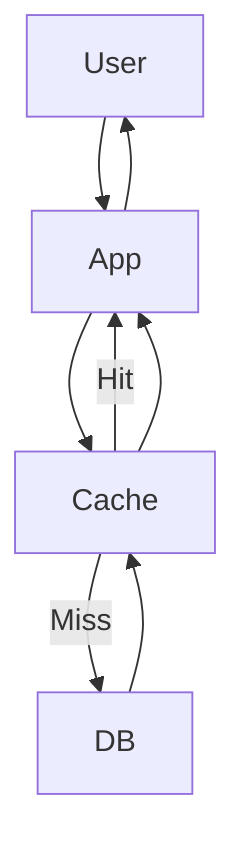
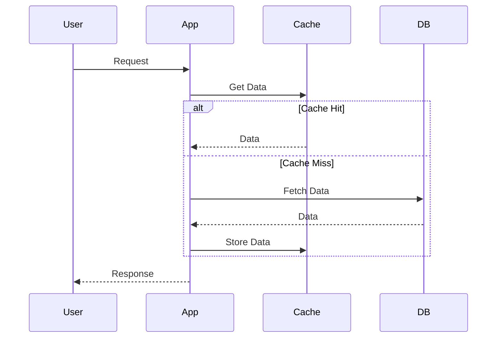
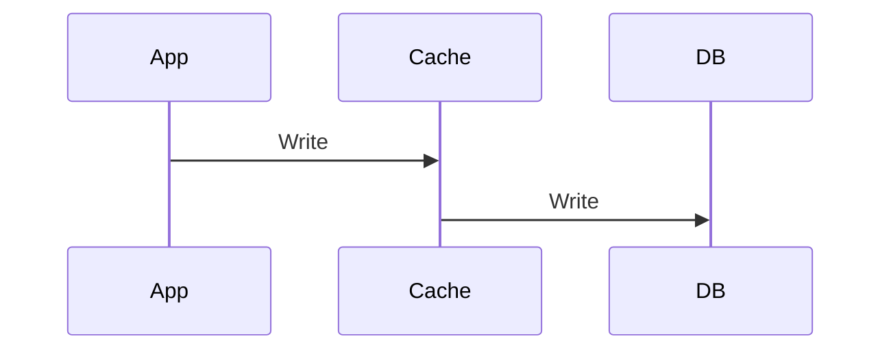
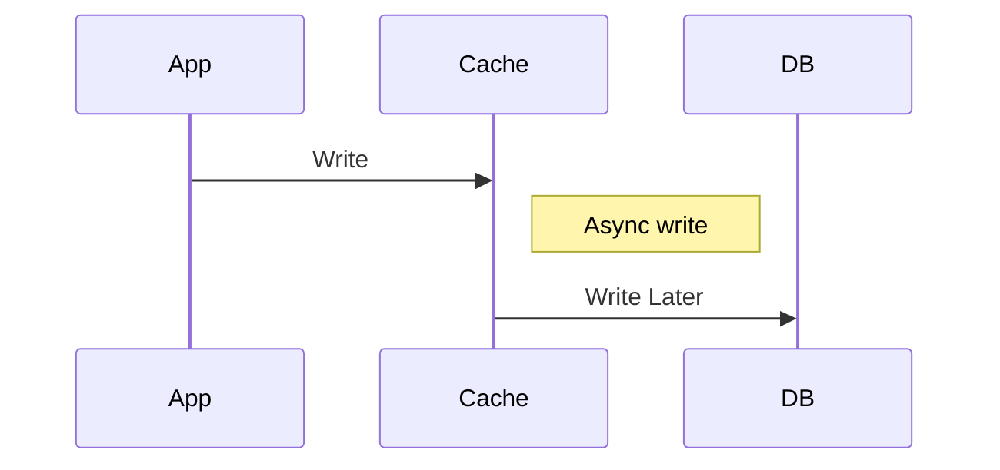
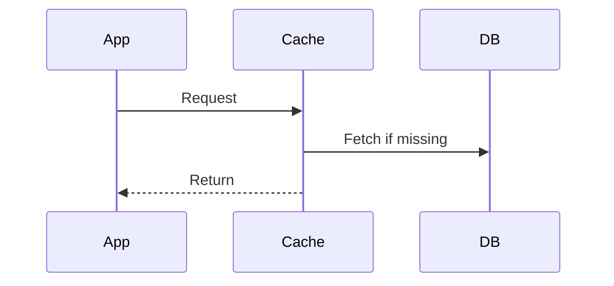
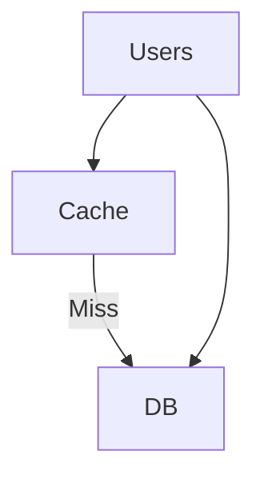
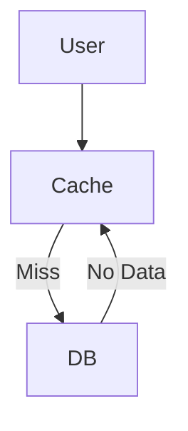
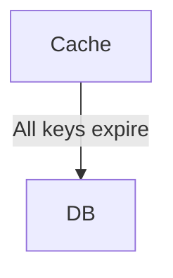
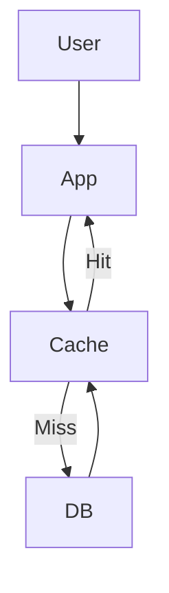

---

# 🚀 Caching - Complete Backend Guide

---

## 🧠 What is Caching?

Caching is storing frequently accessed data in a faster storage layer (like Redis) to reduce latency and database load.

---

## ⚡ Why Caching?

### ✅ Advantages

* Faster response time
* Reduced DB load
* High scalability

### ❌ Trade-offs

* Stale data
* Invalidation complexity
* Memory cost

---

## 🧩 Caching Architecture

---

## 🧠 Cache Aside (Lazy Loading)

---

## 🔥 Write Through

---

## 🔥 Write Back (Write Behind)

---

## 🔥 Read Through

---

## ⚠️ Cache Invalidation

* TTL (Time To Live)
* Manual eviction
* Versioning
* Write-through updates

---

## 💣 Cache Stampede

👉 Problem: Too many requests hit DB simultaneously

---

## 🧠 Request Coalescing (IMPORTANT)

👉 Only **one request hits DB**, others wait

---

## ❌ Cache Penetration

---

## ❌ Cache Avalanche

---

## ⚙️ Eviction Policies

* LRU ✅
* LFU
* FIFO
* TTL-based

---

## 🏗️ Real Use Case (E-commerce)

### Product Data

* Cache Aside
* TTL: 5–10 min

### Inventory

* Avoid caching OR very short TTL
* Use Write-through

---

## ⚖️ Trade-offs

| Factor      | Cache  | DB     |
| ----------- | ------ | ------ |
| Speed       | ⚡ Fast | Slow   |
| Consistency | Weak   | Strong |
| Cost        | Memory | Disk   |

---

## 🎯 Interview Answer

> Caching is used to store frequently accessed data in a fast layer like Redis to reduce latency and DB load. Common strategies include cache-aside, write-through, and write-back. Key challenges include cache invalidation and handling cache stampede using techniques like request coalescing.

---

## 🧠 Pro Tips

* Always mention **trade-offs**
* Talk about **invalidation**
* Explain **failure scenarios**
* Use **real-world examples**

---

## 🔥 Bonus (Interview Killer Line)

> “We can prevent cache stampede using request coalescing or distributed locking.”

---

### Inventory (Frequent Updates)

* Do NOT cache aggressively
* Use Write Through or DB-first
* Short TTL or no cache

---

Request Coalescing (Very Important Concept)

👉 Request Coalescing = combining multiple identical requests into a single request
so that only one call hits the backend (DB/API), and others wait for the same result.

🔥 Why Do We Need It?

Imagine:

1000 users request the same product at the same time
Cache is empty ❌

👉 Without coalescing:

1000 requests → DB 💥 (overload)

👉 With coalescing:

1 request → DB
