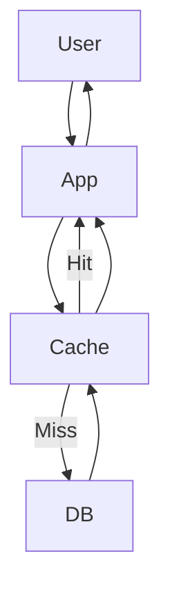
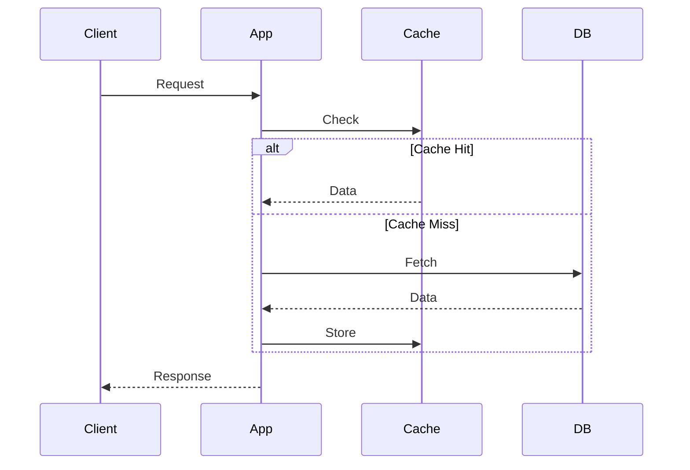
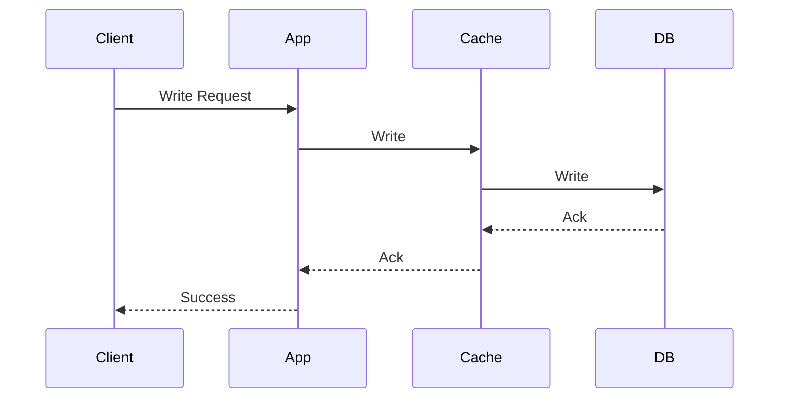
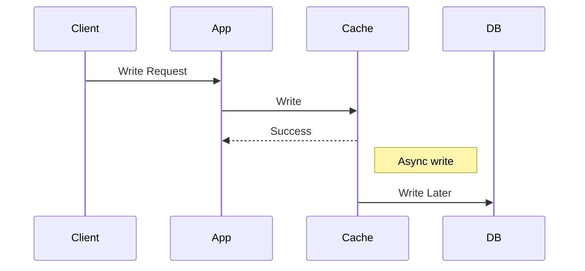
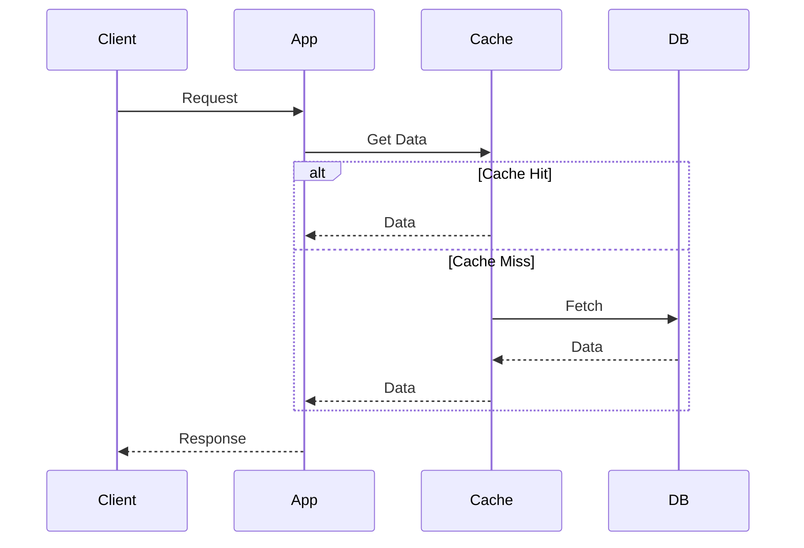
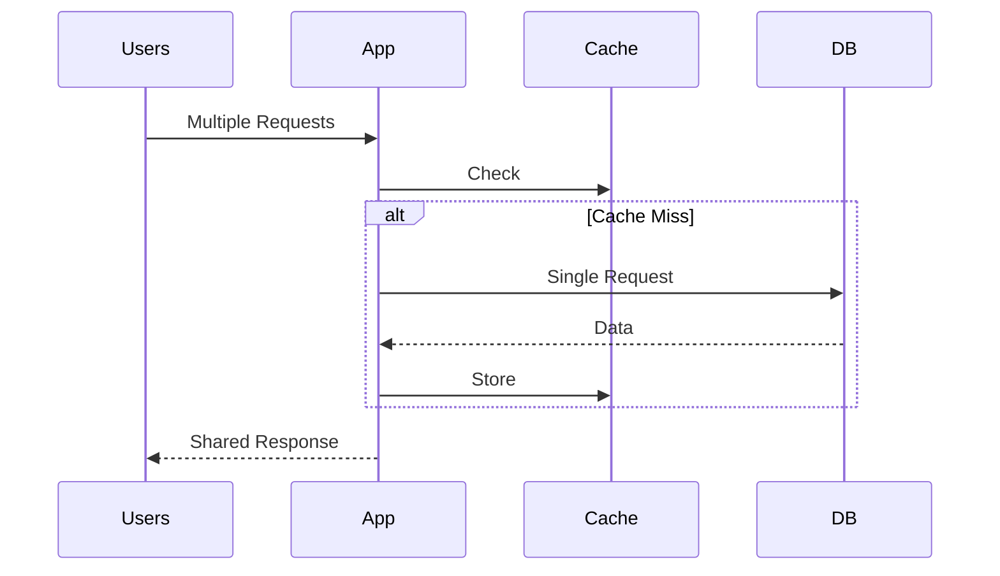
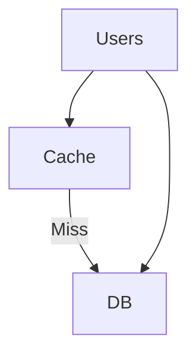
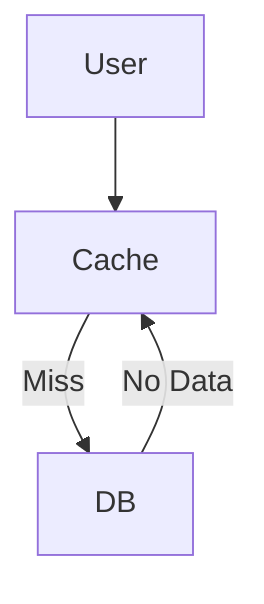
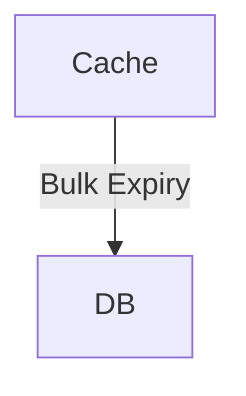
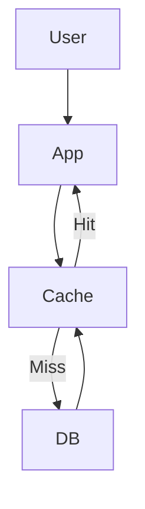

# 🚀 Caching - Complete Backend Guide

---

## 🧠 What is Caching?

Caching is storing frequently accessed data in a faster storage layer (like Redis) to reduce latency and database load.

---

## ⚡ Why Caching?

### ✅ Advantages

* Faster response time
* Reduced DB load
* High scalability

### ❌ Trade-offs

* Stale data
* Cache invalidation complexity
* Memory cost

---

## 🧩 Caching Architecture



---

# 🧠 Caching Patterns (Flow + Diagram)

---

## 🔥 1. Cache Aside (Lazy Loading)

### 📌 Flow

```text
1. Client sends request
2. Application checks cache
3. If cache hit → return data
4. If cache miss:
    → Fetch from DB
    → Store in cache
    → Return response
```

### 📊 Diagram



---

## 🔥 2. Write Through

### 📌 Flow

```text
1. Client sends write request
2. Application writes to cache
3. Cache writes to DB
4. Acknowledgement returned to client
```

### 📊 Diagram



---

## 🔥 3. Write Back (Write Behind)

### 📌 Flow

```text
1. Client sends write request
2. Application writes to cache
3. Cache responds immediately
4. Cache updates DB asynchronously
```

### 📊 Diagram



---

## 🔥 4. Read Through

### 📌 Flow

```text
1. Client requests data
2. App asks cache
3. Cache:
   → Hit → return data
   → Miss → fetch from DB
4. Cache stores data
5. Return response
```

### 📊 Diagram



---

## 🔥 5. Request Coalescing (Anti-Stampede)

### 📌 Flow

```text
1. Multiple requests for same key arrive
2. First request goes to DB
3. Other requests wait
4. Result stored in cache
5. All requests receive same response
```

### 📊 Diagram



---

# 💣 Common Problems

---

## ❌ Cache Stampede

### 📌 Flow

```text
1. Cache expires
2. Many requests hit at same time
3. All go to DB
4. DB overload
```

### 📊 Diagram



---

## ❌ Cache Penetration

### 📌 Flow

```text
1. Request for non-existing data
2. Cache miss
3. DB miss
4. Repeated DB hits
```

### 📊 Diagram



---

## ❌ Cache Avalanche

### 📌 Flow

```text
1. Many keys expire together
2. Sudden DB load spike
```

### 📊 Diagram



---

# ⚙️ Cache Invalidation

* TTL (Time To Live)
* Manual deletion
* Versioning
* Write-through consistency

---

# ⚙️ Eviction Policies

* LRU ✅
* LFU
* FIFO
* TTL-based

---

# 🏗️ Real Use Case (E-commerce)



### Product Data

* Cache Aside
* TTL: 5–10 min

### Inventory

* Write-through or DB-first
* Very short TTL / no cache

---

# ⚖️ Trade-offs

| Factor      | Cache  | DB     |
| ----------- | ------ | ------ |
| Speed       | ⚡ Fast | Slow   |
| Consistency | Weak   | Strong |
| Cost        | Memory | Disk   |

---

# 🎯 Interview Answer

> Caching is a technique to store frequently accessed data in a fast layer like Redis to reduce latency and DB load. Common strategies include cache-aside, write-through, and write-back. Key challenges include cache invalidation and handling cache stampede using request coalescing.

---

# 🧠 Pro Tips

* Always explain **flow first**
* Then talk about **trade-offs**
* Mention **real-world scenarios**
* Discuss **failure cases**

---

# 🔥 Killer Line (Use in Interview)

> “To prevent cache stampede, we can use request coalescing or distributed locking.”

---


Request Coalescing (Very Important Concept)

👉 Request Coalescing = combining multiple identical requests into a single request
so that only one call hits the backend (DB/API), and others wait for the same result.

🔥 Why Do We Need It?

Imagine:

1000 users request the same product at the same time
Cache is empty ❌

👉 Without coalescing:

1000 requests → DB 💥 (overload)

👉 With coalescing:

1 request → DB
