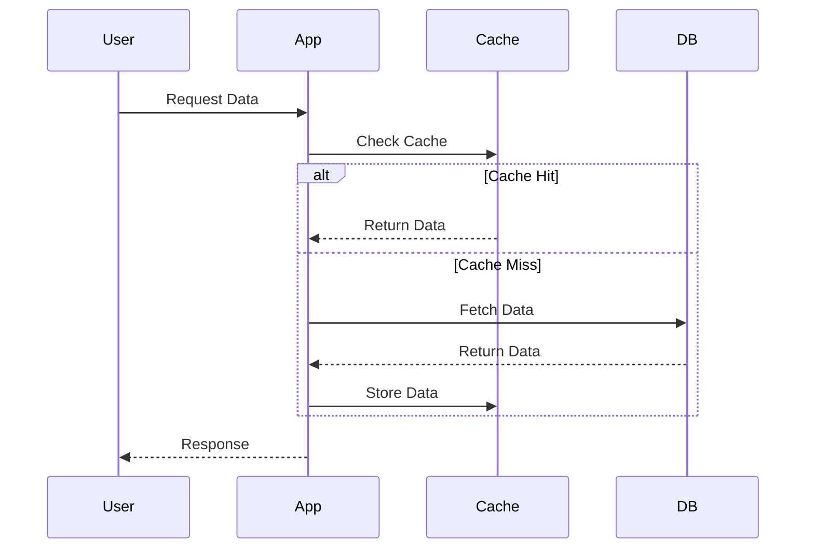
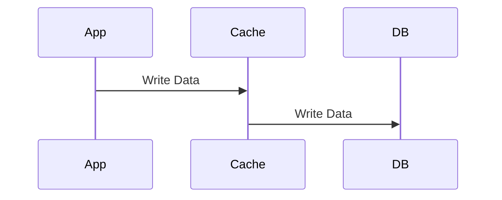
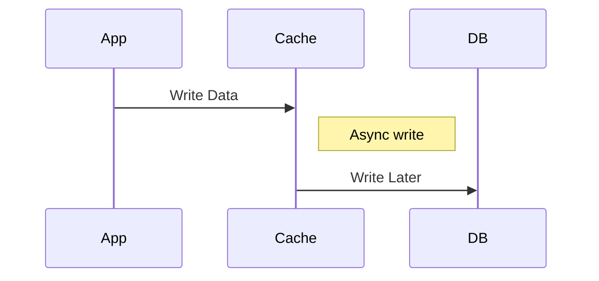
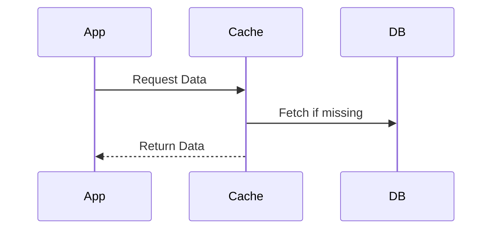
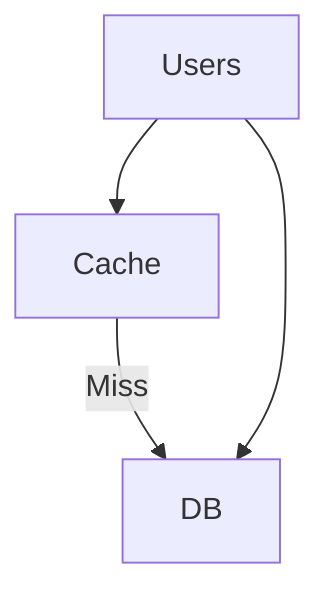
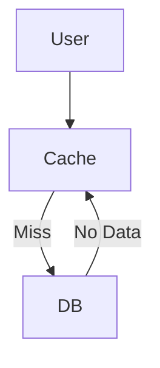
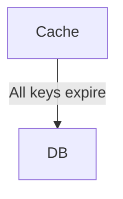

# 🚀 Caching - Complete Backend Guide

## 📌 What is Caching?

Caching is the process of storing frequently accessed data in a faster storage layer to reduce latency and database load.

```text
DB → Slow (ms–seconds)
Cache → Fast (microseconds–ms)
```

---

## ⚡ Why Caching?

### ✅ Advantages

* Faster response time
* Reduced DB load
* Better scalability
* Handles traffic spikes

### ❌ Trade-offs

* Stale data
* Cache invalidation complexity
* Memory cost

---

## 🧩 Types of Caching

### 1. Client-Side Cache (Browser)

* Controlled via HTTP headers
* Example: `Cache-Control`, `ETag`

---

### 2. CDN Cache

* Stores static content globally
* Example: images, CSS, JS

---

### 3. Application Cache

* Stored in memory (Redis, Memcached)
* Used for DB results

---

### 4. Database Cache

* Internal DB caching (less used now)

---

## 🧠 Caching Strategies

---

### 🔥 1. Cache Aside (Lazy Loading)



✔ Most common
❌ First request slow

---

### 🔥 2. Write Through



✔ Strong consistency
❌ Slower writes

---

### 🔥 3. Write Back (Write Behind)



✔ Fast writes
❌ Risk of data loss

---

### 🔥 4. Read Through



✔ Clean abstraction
❌ More complex

---

## ⚠️ Cache Invalidation

> “There are only two hard things in CS: Cache invalidation & naming things.”

### Techniques:

* TTL (Time To Live)
* Manual deletion
* Versioning
* Write-through updates

---

## 💣 Common Problems

---

### ❌ Cache Stampede (Thundering Herd)



✔ Solution:

* Locking
* Request coalescing
* Random TTL

---

Flow:
* First request comes → cache miss
* It acquires a lock / promise
* Other requests: See "in-progress"
Wait instead of hitting DB
* First request completes → result stored in cache
* All waiting requests get same response

### ❌ Cache Penetration



✔ Solution:

* Cache null values
* Bloom filters

---

### ❌ Cache Avalanche



✔ Solution:

* Random TTL
* Stagger expiration

---

## ⚙️ Eviction Policies

* LRU (Least Recently Used) ✅
* LFU (Least Frequently Used)
* FIFO
* TTL-based

---

## 🏗️ Use Cases

* Product catalog
* User sessions
* API responses
* Search results
* Rate limiting

---

## 🔐 Redis Use Cases

* Caching
* Pub/Sub
* Rate limiting
* Leaderboards
* Distributed locks

---

## ⚖️ Trade-offs

| Factor      | Cache  | DB     |
| ----------- | ------ | ------ |
| Speed       | ⚡ Fast | Slow   |
| Consistency | Weak   | Strong |
| Cost        | Memory | Disk   |

---

## 🎯 Interview Answer (Short)

> Caching is a technique to store frequently accessed data in a fast storage layer like Redis to reduce latency and database load. Common strategies include cache-aside, write-through, and write-back. Key challenges include cache invalidation and handling issues like cache stampede.

---

## 🚀 Real Interview Scenario

### E-commerce Product Page

### Product Details

* Cache Aside
* TTL = 5–10 mins
* CDN for static data

### Inventory (Frequent Updates)

* Do NOT cache aggressively
* Use Write Through or DB-first
* Short TTL or no cache

---

Request Coalescing (Very Important Concept)

👉 Request Coalescing = combining multiple identical requests into a single request
so that only one call hits the backend (DB/API), and others wait for the same result.

🔥 Why Do We Need It?

Imagine:

1000 users request the same product at the same time
Cache is empty ❌

👉 Without coalescing:

1000 requests → DB 💥 (overload)

👉 With coalescing:

1 request → DB
