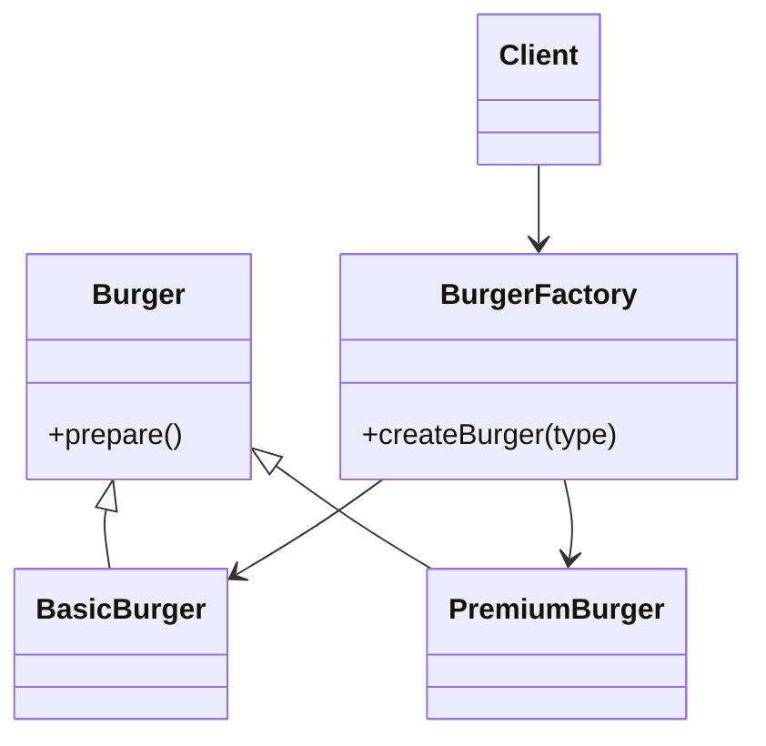
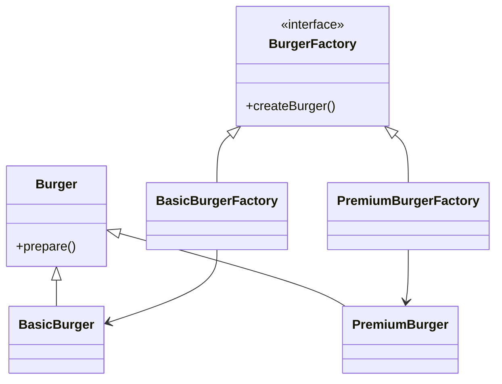

# Factory Method vs Simple Factory

## Overview


# 1️⃣ Simple Factory

## Definition

A **Simple Factory** is a class that contains a method responsible for creating objects based on input parameters.

The client asks the factory for an object, and the factory decides **which class to instantiate**.

⚠️ **Note:** Simple Factory is **not an official GoF design pattern**. It is a **coding technique**.

---

## Example (Python)

```python
class Burger:
    def prepare(self):
        pass


class BasicBurger(Burger):
    def prepare(self):
        print("Preparing Basic Burger")


class PremiumBurger(Burger):
    def prepare(self):
        print("Preparing Premium Burger")


class BurgerFactory:

    @staticmethod
    def create_burger(type):

        if type == "basic":
            return BasicBurger()

        elif type == "premium":
            return PremiumBurger()

        else:
            return None


# Client Code
burger = BurgerFactory.create_burger("basic")
burger.prepare()
```

---

## UML Diagram (Simple Factory)



---

## Problem with Simple Factory

When a **new product is added**, the factory **must be modified**.

Example:

```python
elif type == "cheese":
    return CheeseBurger()
```

This means we are **modifying existing code**, which **violates the Open–Closed Principle (OCP)**.

---

# 2️⃣ Factory Method Pattern

## Definition

The **Factory Method Pattern** defines an interface for creating objects, but lets **subclasses decide which class to instantiate**.

Instead of one large factory, we create **multiple specialized factories**.

---

## Example (Python)

```python
from abc import ABC, abstractmethod


class Burger(ABC):

    @abstractmethod
    def prepare(self):
        pass


class BasicBurger(Burger):
    def prepare(self):
        print("Preparing Basic Burger")


class PremiumBurger(Burger):
    def prepare(self):
        print("Preparing Premium Burger")


class BurgerFactory(ABC):

    @abstractmethod
    def create_burger(self):
        pass


class BasicBurgerFactory(BurgerFactory):

    def create_burger(self):
        return BasicBurger()


class PremiumBurgerFactory(BurgerFactory):

    def create_burger(self):
        return PremiumBurger()


# Client Code
factory = BasicBurgerFactory()
burger = factory.create_burger()
burger.prepare()
```

---

## UML Diagram (Factory Method)



---

# 3️⃣ How Factory Method Follows OCP

When we introduce a new product:

```
CheeseBurger
```

We **do not modify existing factories**.

Instead we create a **new factory**:

```python
class CheeseBurgerFactory(BurgerFactory):

    def create_burger(self):
        return CheeseBurger()
```

Existing classes remain **unchanged**.

This satisfies:

✔ **Open for extension**
✔ **Closed for modification**

---

# 4️⃣ Key Differences

| Feature      | Simple Factory | Factory Method     |
| ------------ | -------------- | ------------------ |
| Pattern Type | Not GoF        | GoF Design Pattern |
| Factories    | One            | Multiple           |
| Flexibility  | Low            | High               |
| OCP          | Violated       | Followed           |
| Scalability  | Poor           | Good               |

---

# 5️⃣ When to Use

## Use Simple Factory when

* Small application
* Few object types
* Simple implementation required

## Use Factory Method when

* System needs to be **extensible**
* Many product types
* Following **SOLID design principles**

---

# 6️⃣ Summary

### Simple Factory

* Centralizes object creation
* Requires modifying the factory when new products are added
* Violates **Open–Closed Principle**

### Factory Method

* Distributes object creation across multiple factories
* Allows system extension **without modifying existing code**
* Follows **SOLID principles**

✅ This makes **Factory Method more scalable and maintainable**.

---

# 📚 Key Takeaway

| Pattern        | Main Idea                                  |
| -------------- | ------------------------------------------ |
| Simple Factory | One factory decides which object to create |
| Factory Method | Subclasses decide which object to create   |

Factory Method improves **extensibility, scalability, and maintainability** of large systems.

---

⭐ If you found this helpful, consider adding this to your **LLD / Design Patterns notes**.
# Factory Method vs Simple Factory

## Overview

This document explains the difference between **Simple Factory** and the **Factory Method Design Pattern**, how they work, and how the **Open–Closed Principle (OCP)** applies to them.

Both patterns are used to **create objects without exposing the creation logic to the client**.

---

# 1️⃣ Simple Factory

## Definition

A **Simple Factory** is a class that contains a method responsible for creating objects based on input parameters.

The client asks the factory for an object, and the factory decides **which class to instantiate**.

⚠️ **Note:** Simple Factory is **not an official GoF design pattern**. It is a **coding technique**.

---

## Example (Python)

```python
class Burger:
    def prepare(self):
        pass


class BasicBurger(Burger):
    def prepare(self):
        print("Preparing Basic Burger")


class PremiumBurger(Burger):
    def prepare(self):
        print("Preparing Premium Burger")


class BurgerFactory:

    @staticmethod
    def create_burger(type):

        if type == "basic":
            return BasicBurger()

        elif type == "premium":
            return PremiumBurger()

        else:
            return None


# Client Code
burger = BurgerFactory.create_burger("basic")
burger.prepare()
```

---

## UML Diagram (Simple Factory)


---

## Problem with Simple Factory

When a **new product is added**, the factory **must be modified**.

Example:

```python
elif type == "cheese":
    return CheeseBurger()
```

This means we are **modifying existing code**, which **violates the Open–Closed Principle (OCP)**.

---

# 2️⃣ Factory Method Pattern

## Definition

The **Factory Method Pattern** defines an interface for creating objects, but lets **subclasses decide which class to instantiate**.

Instead of one large factory, we create **multiple specialized factories**.

---

## Example (Python)

```python
from abc import ABC, abstractmethod


class Burger(ABC):

    @abstractmethod
    def prepare(self):
        pass


class BasicBurger(Burger):
    def prepare(self):
        print("Preparing Basic Burger")


class PremiumBurger(Burger):
    def prepare(self):
        print("Preparing Premium Burger")


class BurgerFactory(ABC):

    @abstractmethod
    def create_burger(self):
        pass


class BasicBurgerFactory(BurgerFactory):

    def create_burger(self):
        return BasicBurger()


class PremiumBurgerFactory(BurgerFactory):

    def create_burger(self):
        return PremiumBurger()


# Client Code
factory = BasicBurgerFactory()
burger = factory.create_burger()
burger.prepare()
```

---

## UML Diagram (Factory Method)


---

# 3️⃣ How Factory Method Follows OCP

When we introduce a new product:

```
CheeseBurger
```

We **do not modify existing factories**.

Instead we create a **new factory**:

```python
class CheeseBurgerFactory(BurgerFactory):

    def create_burger(self):
        return CheeseBurger()
```

Existing classes remain **unchanged**.

This satisfies:

✔ **Open for extension**
✔ **Closed for modification**

---

# 4️⃣ Key Differences

| Feature      | Simple Factory | Factory Method     |
| ------------ | -------------- | ------------------ |
| Pattern Type | Not GoF        | GoF Design Pattern |
| Factories    | One            | Multiple           |
| Flexibility  | Low            | High               |
| OCP          | Violated       | Followed           |
| Scalability  | Poor           | Good               |

---

# 5️⃣ When to Use

## Use Simple Factory when

* Small application
* Few object types
* Simple implementation required

## Use Factory Method when

* System needs to be **extensible**
* Many product types
* Following **SOLID design principles**

---

# 6️⃣ Summary

### Simple Factory

* Centralizes object creation
* Requires modifying the factory when new products are added
* Violates **Open–Closed Principle**

### Factory Method

* Distributes object creation across multiple factories
* Allows system extension **without modifying existing code**
* Follows **SOLID principles**

✅ This makes **Factory Method more scalable and maintainable**.

---

# 📚 Key Takeaway

| Pattern        | Main Idea                                  |
| -------------- | ------------------------------------------ |
| Simple Factory | One factory decides which object to create |
| Factory Method | Subclasses decide which object to create   |

Factory Method improves **extensibility, scalability, and maintainability** of large systems.

---

